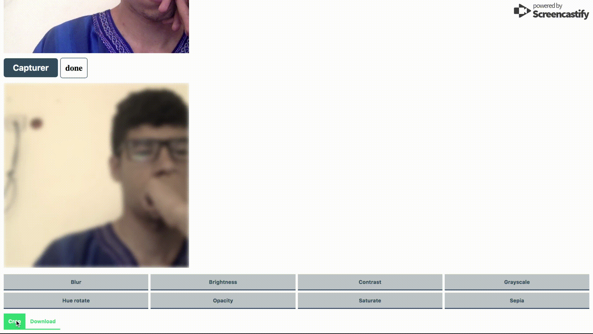
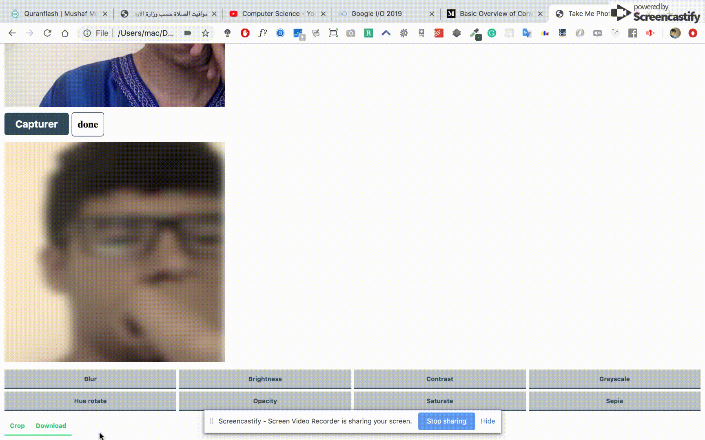

# Take Me Photo

This is a small library, easy to integrate with any application in order to take a user's picture using the webcam.

## 1. How to use

First of all you should download or clone this repo. the main script exist in index.js.

```html
<script>
    const takemephoto = new TakeMePhoto({
        containerId: 'the container element id',
        width?: 400,
        height?: 400,
        defaultVideoPath?: 'path to the default video in case your browser doesn\' support getUserMedia',
        captureMsg?: 'capture button text content',
    });

    // Then you can invoke the start method let the library start its work 😊.
    takemephoto.start();
</script>
```

`Notice:` the container element is required in order to run the script.

Also, there are some predefined classes for multiple elements in order to give the user the ability the change the default styling.
Here is a list of classes the user can use.

```css
.stream-video {
    class of the video tag
}

.capture-button {
    class of the capture button
}

.timer-span {
    class of the timer
}

.main-canvas {
    class of the main canvas (that contains final capture)
}

.filter-wrapper, .control-wrapper {
    wrapper of the filters buttons
    wrapper of the control buttons (crop & download)
}

.takemephoto-btn {
    class of both filter & control buttons
}

```

## 3. Process

Process of capturing an image


Process of applying filter to the capture


Process of cropping the capture


Process of downloading the image (with a random name)


## 2. Demo

Check [example](./example/index.html) to see a demo of working application.